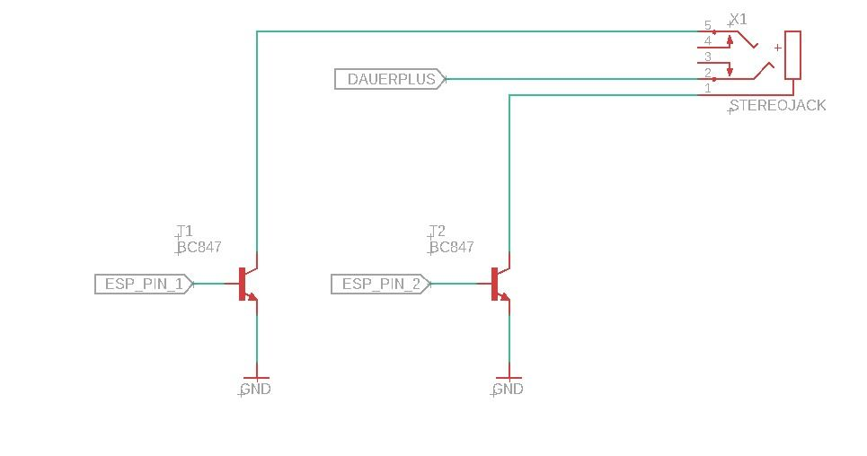
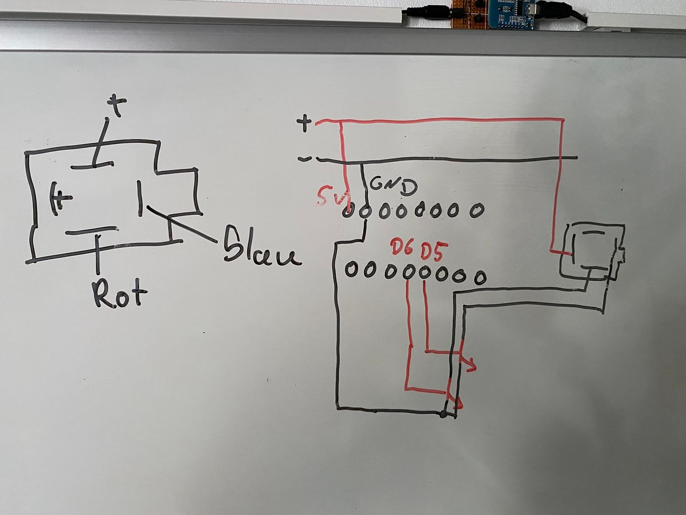
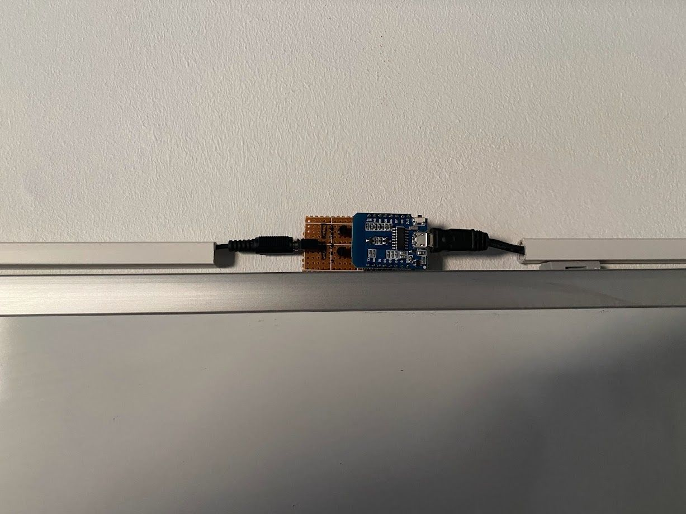
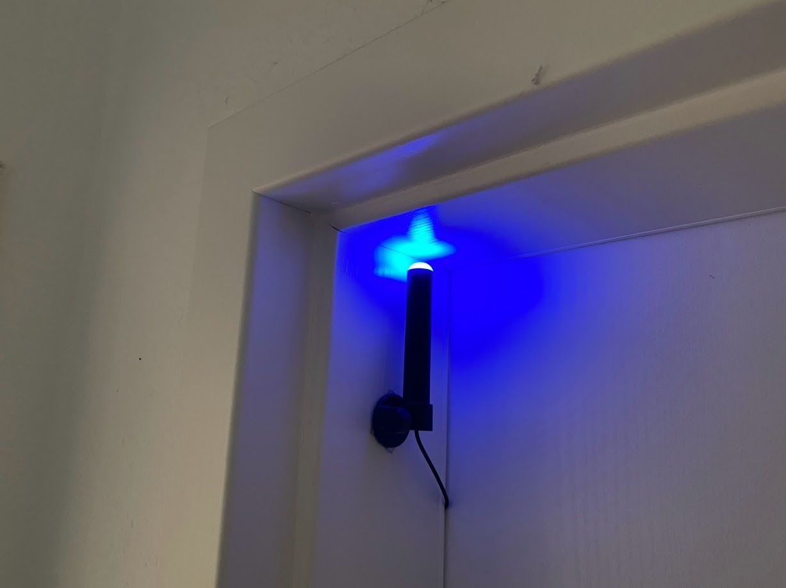

During the peaks of Corona, when both my girlfriend and i worked from home, we had some situations where one of us was in a call, and should not get disturbed. The usual open/closed door indicator did not work, because if we let the doors to our working rooms stay open, our cat would come by and require attention, which is not a good idea if you want to do some uninterrupted work. So we needed a solution to signalize the "door is closed, but feel free to come in" or "door is closed, i am in a call, please do not disturb" to each other.

Fortunately there are things like Busylights. Small lights which you can attach to your screen, office door, whatever, to indicate that you are on the phone, or whatever else. I got my hands on a cheap used [Kuando Busylight Combi](https://busylight.com/kuando-busylight-combi/) from eBay. This thing is apparently from the 90s. It consists of a controller which you can hook between your desk phone and its headset, and the actual light. The controller has a hardware dial where you can set some specific settings so that it detects when your headset is in use, and then light up the light. The light itself has a red and a blue LED and is connected to the controller with a 2,5mm 3-pole headphone jack.

Since we are living in the 2020s and at least in my company, wired desk phones are a thing from the past, which were replaced by MS Teams, i needed a solution to get rid of the controller, and do some fancy IoT stuff.

First i analyzed the headphone jack of the light. I do not know the "proper" names of the 3 contacts, so let's call them "tip", "mid" and "base". When using a stereo headphone, the tip is usually the common GND connection, while mid and base are the signal connection to each side's speaker. The initial assumption to have a similar logic for the busylight, for each LED, did not turn out to be correct.

Instead, the wiring must be as following:

- Add +5V to the mid contact.
- Want to light up the blue light? Add GND to the base contact.
- Want to light up the red light? Add GND to the tip contact.
- If both tip and base are pulled to GND, both LEDs are lit, and the whole thing is purple.

I wanted to control the light with a usual ESP8266 Microcontroller, which is able to send out HIGH signals from its output pins. These signals are used to control tw BC847 transistors which will then pull the headphone jack connector to GND.

I ordered some headphone jacks with 4 connectors, and concluded the following (very professional) wiring layout:

After soldering everything together, using some generic PCB, it looked like this:

I wanted to control the light with MQTT. Three topics, one for red, one for blue, one for purple, each with ON or OFF as a valid payload. Red and blue mutually exclusive, both lights should only be on at the same time when a purple light is explicitly requested. I wrapped a quick firmware together, with the help of [PlatformIO](https://platformio.org/), and uploaded everything to [GitHub](https://github.com/simonszu/esp-busylight).

As you can already see, i wired the connection to the actual light through some cable channels, through the door of my room and attached the light itself to the frame of the door with the help of some double-sided tape.

By integrating the MQTT connection to [Home Assistant](https://www.home-assistant.io/) i am able to include the light into some neat automations like:

- If the microphone of my PC (sensed with the Home Assistant App for macOS) is reported as "active", switch on the light.
- If my work calendar has a current appointment, and the state of my work mobile phone is "at home", switch on the light.

Unfortunately the red LED of the light died soon after, maybe it wasn't a very good idea to route the cabling behind the door. But since the blue LED is still working as intended, i am only limited to signaling one state to the outside world. Still better than being interrupted during an important call with the customer.