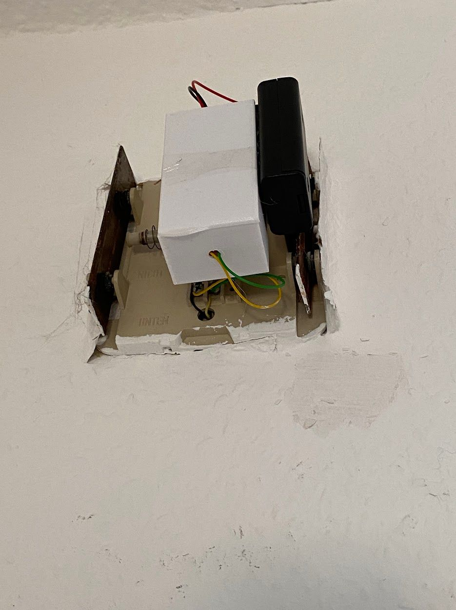

I am a huge fan of IoT and smart home. For that reason, i have deployed an instance of [Home Assistant](https://www.home-assistant.io) to my home server and am thriving to get all kinds of sensor data into the system which then gets evaluated by automation scripts.

One challenge i wanted to face: Sometimes when i am playing games with headphones, or simply when i am at the far end of our apartment (which is quite big) i do not hear the doorbell, which can be a bit inconvenient. For that reason i created a MQTT enabled smart doorbell addon.

Luckily for me, we have a very simple doorbell. Just one physical bell, which gets current from a transformer when the button is pressed. Push button: Ding, release button: Dong. So, what i needed was something to react to the bell circuit getting current.

After some research i found [an article](https://www.reichelt.de/magazin/how-to/smarte-tuerklingel/) on reichelt.de explaining how to construct a smart doorbell which will trigger some actions in the Fritz!box ecosystem. Since it had an approach on the hardware side which i needed, i adapted this concept, but changed the software. Please refer to this article how to create the hardware circuit. It's nothing more than a resistor to make the voltage of the doorbell circuit suitable to a PC817 optocoupler and a diode to filter out the alternating current which is usually used to drive a doorbell.

From a software side, the logic should be as following:

1. The ESP boots and immediately goes into deep sleep
2. If the bell is triggered, the circuit should, via the optocoupler, shorten the ESP's wake-up contact
3. The ESP wakes up, connects to the WiFi and sends a trigger message to an MQTT topic to simulate a logical HIGH
4. After 2-3 seconds, the ESP sends an offline message to the same topic to simulate a logical LOW and goes to deep sleep again

I needed to use the deep sleep, because i do not have any power source next to my doorbell besides the doorbell circuit itself. I cannot drive the ESP via the doorbell circuit itself, letting it boot and so on, when the bell is triggered, since the one second or so while somebody has their finger on the doorbell button is too short to do everything, which is not reliable. So i am driving the ESP with 2x AA batteries, and using the deep sleep for power saving.

I used a 330 Ohm resistor, suitable for 6-8V of circuit voltage. The optocoupler's secondary contacts are soldered to the ESP's RST and GND pins. If the bell circuit voltage drops to 0 Volts, the LOW signal triggers the reset of the ESP with the logic described above. The battery compartment for the two AA batteries is just soldered to the GND and +3,3V pin of the ESP. Of course, i did not use a plain ESP chip, but a Wemos D1 mini, which is my daily driver for such projects.

As you can see, the circuitry is very simple.

I have written the source code of the firmware with [platform.io](https://platformio.org). It can be found on [GitHub](https://github.com/simonszu/esp-mqtt-doorbell). It's not that complex, you should be able to find out yourself, where to change your WiFi credentials and your desired MQTT topic.

The sensor definition in Home Assistant looks like this:


- platform: mqtt
  state_topic: "tuerklingel/status"
  name: "tuerklingel_status"


And the automation triggers just check for a state change of that entity, if the state changes from `OFFLINE` to `ONLINE`, that means that the doorbell was used. If the doorbell is used multiple times, the ESP will not have the time to send an `OFFLINE` message to the MQTT topic, so you won't get spammed with notifications or whatever.

I have also tried to design a case for the whole stuff, enabling me to attach it to the bell with some double-sided tape, but this case is embarrassingly bad (note the clear scotch tape to hold it's lid), so i won't publish it.

Note the grey and black cables coming out of the wall, which are connected to the bell with some screw terminals. I have connected the green and yellow trigger cables to the same terminals. On the upper side of the white box are the red and black cables coming from the black battery compartment.

So far, the first set of batteries are driving the whole setup for over 8 months now. I am quite happy with the overall outcome. The only downsides are:

- It is not carefree, one needs to change the batteries every now and then. Since the ESP goes to deep sleep and the D1 Mini has some kind of voltage regulation, i cannot monitor the batteries' status continuously, so i guess, at some point, the doorbell will ring, but i won't get any notification.

- There is a delay of two seconds between the bell ringing and the notification being sent, which is caused by the ESP to wake up and connect to the WiFi. I tried to make that interval as short as possible, but am out of ideas what i could improve. Pull requests to the Git repo are gladly accepted.

This concludes week 2 of the [One thing a week](https://blog.simonszu.de/posts/one-thing-a-week/) challenge