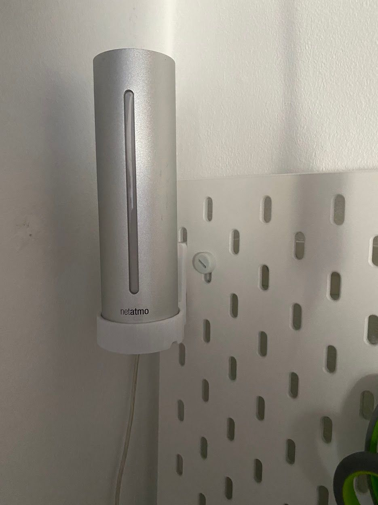

Recently i searched for a way to clean up my tinkering corner in my work room. Like many others i stumbled upon the [Ikea SKADIS](https://www.ikea.com/de/de/search/products/?q=skadis) pegboard series and was hooked - literally. The internet is full of STL files to 3d-print various hooks, shelves and mounts for different objects for this board, so i booted my Ender 3 and went ahead.

During this process i also wanted to mount the base station of my Netatmo weather station to this board, since it currently was just sitting on a table in the corner of my room. I was hoping, when placing it somewhere elevated, i could see its LED for indicating the air quality a bit better - not that i pay that much attention to it, but anyways.

Unfortunately, there were no suitable designs on the usual ~~trusty~~ source of STL files, [Thingiverse](https://www.thingiverse.com/). So i took that as an opportunity to master my skills in [TinkerCAD](https://www.tinkercad.com/dashboard) and designed my own. I had a mount for the outdoor sensor to orient myself on, just exchanging the mount point from two holes for countersunk screws to the awesome [SKADIS universal hook](https://www.thingiverse.com/thing:2849369).

It turned out, TinkerCAD gets complicated very quickly, since its toolset is somehow limited. For example, one can't simply make an edge rounded - no, one has to create a disjunction between a cylindric hole and a cube, change the resulting element to a "hole", and apply that hole to the edge. So, this may be my first and last thing ever i created with TinkerCAD.

When exporting the part, which was designed as a tight fit around the base, it also turned out that TinkerCAD renders a circle as a somewhat coarse polygon, so the base did not fit into my first prototype, and i had to increase the diameter.

In any case, i think the result turned out pretty well:

If you are interested in printing one yourself, here are the relevant links:

- [TinkerCAD](https://www.tinkercad.com/things/7J0f4uMM90y-skadis-netatmo-weather-station-shelf)
- [Thingiverse](https://www.thingiverse.com/thing:5266648)

Lessons learned for myself: Don't use simple tools if the task grows more complex than these tools could handle. I took that as an opportunity to learn the usage of [Fusion360](https://www.autodesk.de/products/fusion-360/personal).

This post also is my contribution to the One thing a week challenge - Week 1.