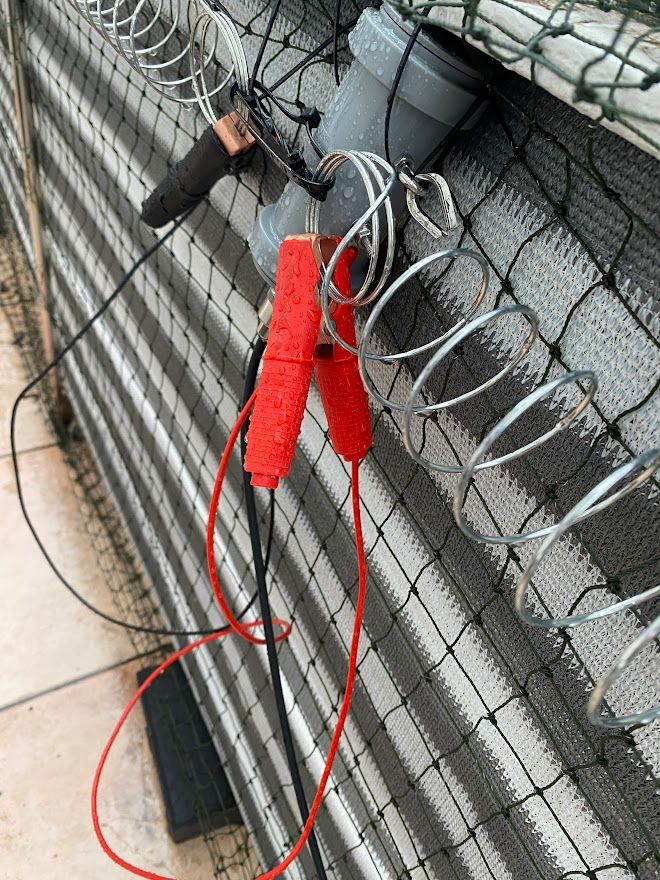
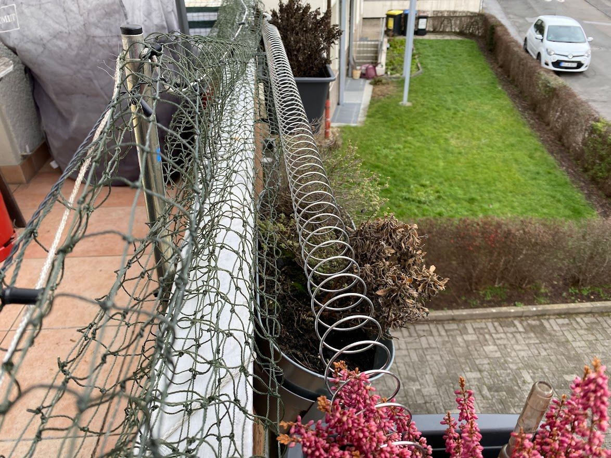
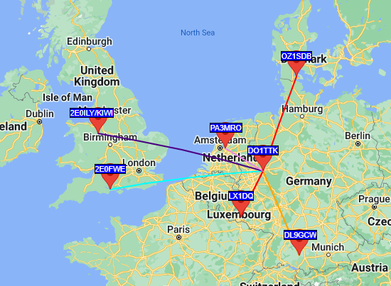
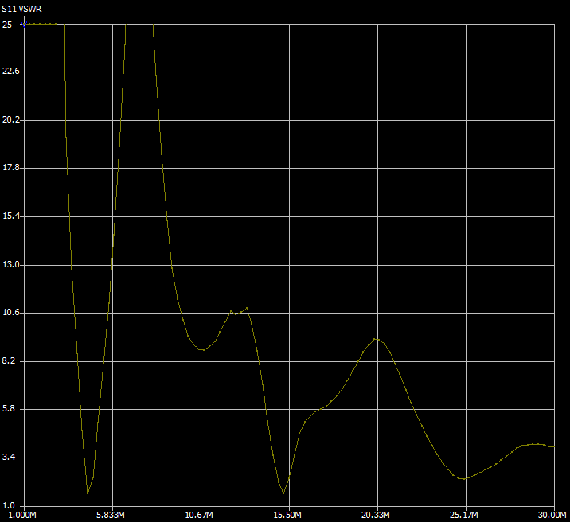
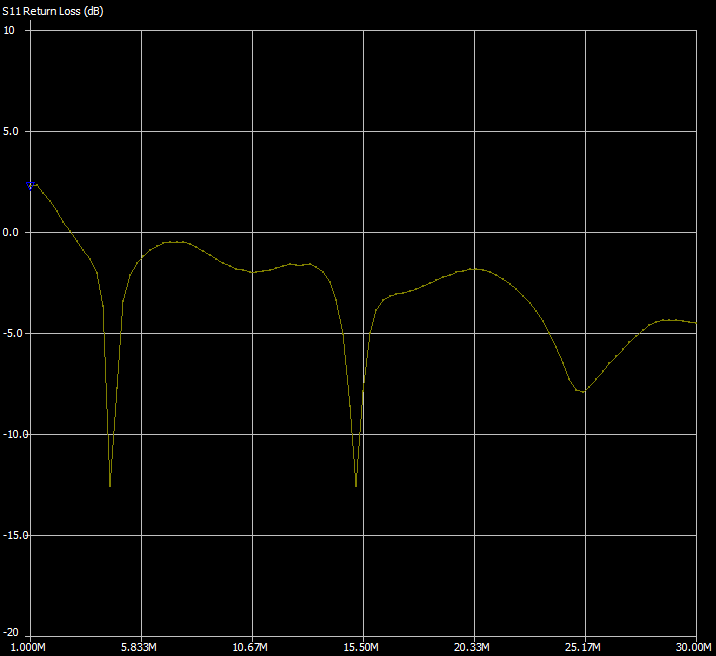

Recently i decided to finally unpack all my ham radio gear from its box where it was stored since our last movement to our current apartment. While being able to do some VHF/UHF activity prior to that with a Diamond X30 antenna, i did not had time to build and set up an antenna for HF frequencies in our old apartment.

Luckily our current apartment has a balcony attached which is rougly 6,50*1,50m in size, so i researched for possibilities to set up an antenna using this 6,50m of length. From older experiments i had parts of a long-wire dipole laying around, mainly a 1:1 Balun, and two quite long wires, which are certainly too long for the balcony.

During some research i stumbled upon the concept of the [Slinky Antenna](https://imgur.com/a/c1m0j). Basically you connect two metal slinkys to the balun as your two poles. Since the wire length of the slinky exceeds the stretched length a lot, this antenna should resonate on frequencies which are usually not in reach when you just use a long wire.

However, the Slinky concept has some drawbacks. First: In Europe it is almost impossible to get metal slinkys, they are usually made from plastic here. Second: They are expensive, even the plastic ones. Importing a metal one from the US is even more expensive. Third: They are not weather proof by default and need some kind of coating so that they don't oxidize. Fourth: They are not designed for being stretched and therefore are not able to carry their own weight, so some kind of nylon rope is needed to let them hang from there.

In a german ham radio forum someone came up with an alternative: Springs for cattle pasture doors. They are cheap, electroconductive (at least for the low power electrical fence setups), weatherproof and able to carry their own weight. I wanted to try this out.

I ordered two springs from an online farming supply store. Each spring costs around 3,50€. Also, to connect them to the balun, i ordered two oversized crocodile clips with cabling which are designed to be used with car batteries for giving a dead battery a jumpstart.

I connected both springs with a cable ziptie, and each remote end to our balcony railing with zipties as well. With even more zipties i mounted the balun to the construction and clamped the crocodile clips to the end of the springs which looks like this:

At first i routed the springs below the balcony railing which was a bit problematic since it was able to touch some metal posts which are responsible to keep up the safety net for our cat, so i moved the springs upwards and laid them on the flower pots which are currently not in use because it is winter.

After stretching out, i counted the loops in the spring. There are 115 loops on each side, each loop having a diameter of around 5cm, which comes towards a wire length of roughly 18 meters per single pole. The physical length is at a little more than 3 meters.

The antenna goes with roughly 8 meters of RG58 cable (and 20cm of RG316 for passing our balcony door) into my shack. An LDG Z11 Pro II is tuning its impedance for my Yaesu FT-817.

At first try, i was a bit impressed. I was able to pick up signals from all across europe on 80m. On FT8 i heard stations from switzerland, denmark, scotland, greece and even russia. However, i was not so successful with having a full QSO on FT8, i don't know why, but i was ignored, so at first i assumed it is the antenna's fault. A bit surprising, since it was resonating so well on 80m that i do not even need the antenna tuner.

I switched the mode to WSPR and made a broadcast with 40W PEP. At least something.

But still no active, bidirectional QSO. I followed some advice and moved the antenna to its current position above the flower pots and tried again on 80 meters with FT8  the next day. Unfortunately i do not have a screenshot, but at least i was heard via FT8 from some stations, the farthest away from southwest france.

I am still not sure why i was ignored, but i surely had some fun building this antenna for so less money and having at least some results. The above posted range is bigger than i ever got on 2 meters, so i can at least consider this a partially success.

I even bought a NanoVNA and made some measurements with this antenna:

So, while still not optimal, i can at least consider it a partial success and will file this experiment as "better than nothing".