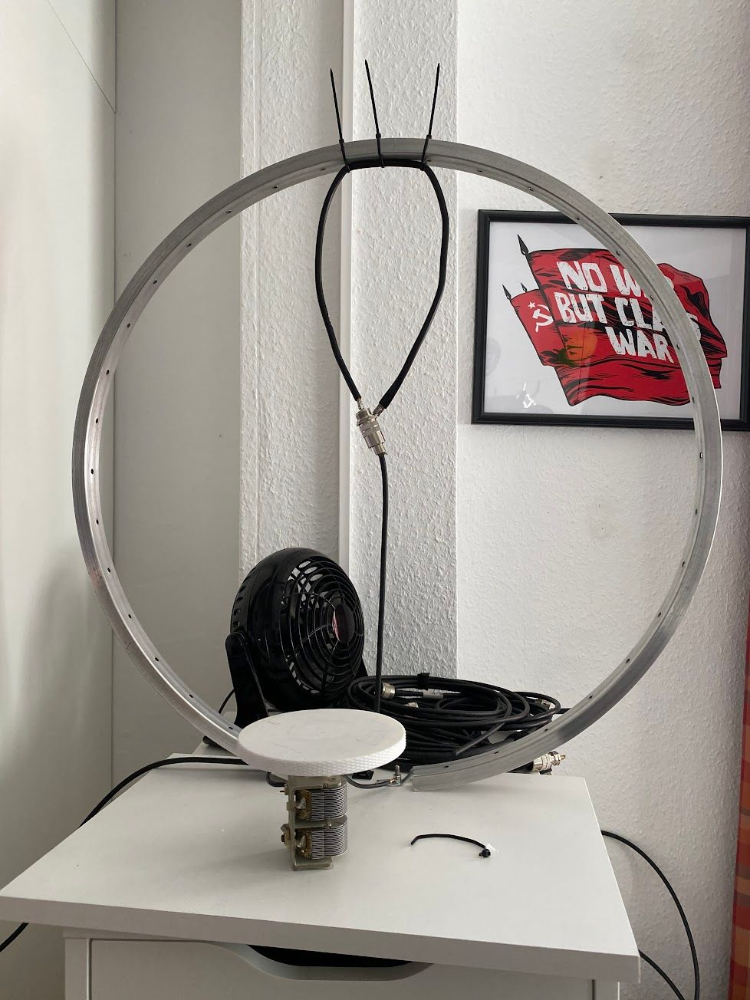
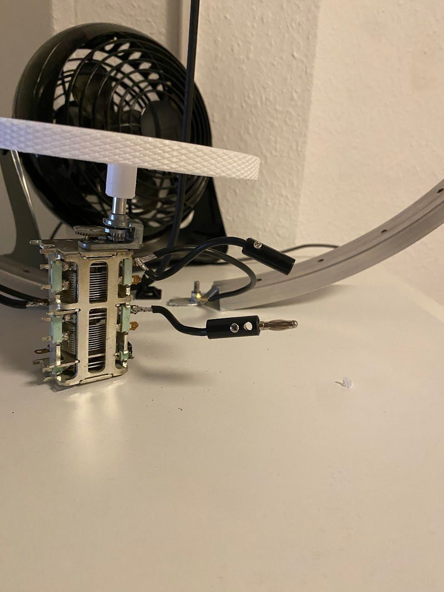
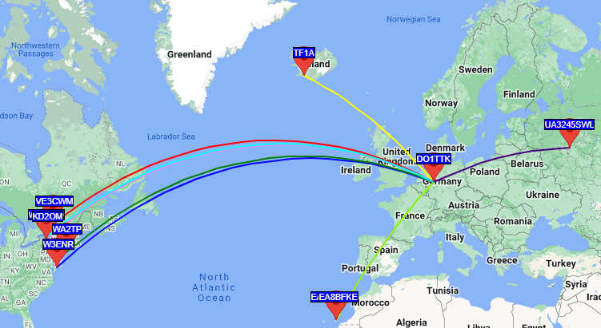
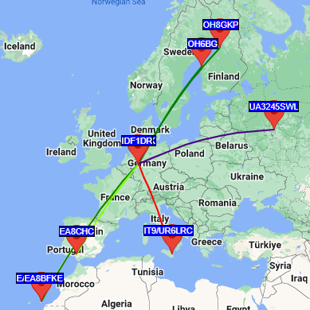

Since i am the usual rented-apartment tenant, and since my experiments with the [Spring Antenna](https://blog.simonszu.de/posts/building-a-dipole-antenna-out-of-a-cattle-pasture-door-spring/) were not that much promising, i decided to build a magnetic loop antenna.

After researching on the internet i found [some](http://www.dl6hh.de/2017/04/23/selbstbau-einer-magnetic-loop-antenne/) [resources](http://www.wuff-bornheimer.de/Bornheimer/Thomas/Vorstellung/Amateurfunk1.html) where hams have already built such an antenna out of an old bicycle wheel. The physical drawbacks of such wheels made out of aluminium which has a smaller conductance than copper are on a breakeven with the fact that such wheels are already perfectly round and can easily be obtained when you ask nicely in a bike shop. Sometimes they have old ones in their scrap metal container, and you can get one for a donation into their money collection box for coffee or similar. I got mine via ebay Kleinanzeigen where a dude just a few blocks away strips old bikes for spare parts. It is a 26" wheel from persumably a children's bike and i got it for 5€.

It has to be mounted somewhere, so i went to the nearest hardware store. Most hardware stores have a service where they cut wooden planks to the customer's desired sizing with a tablesaw. The cutoff parts are sometimes given out for free, if they are too small to be reused for another customer, so i got a 30x40 cm piece of laminated chipboard for free.

I cut open the bike wheel between two holes which are used for mounting the spokes and mounted the cut-open wheel to the board with two M4x30 screws. The screws are intentionally a bit longer, since i need to attach the wires to the capacitor to the wheel. Soldering on aluminium is not very pleasant, so i decided to crimp some ring connectors to the wires and just screw the connectors on the screws as well.

I got the capacitor from ebay. It is some combined thing, like 2x30pf and 2x500pf or something like that. Equipped with a transmission between the turning knob and the actual plate package it promised easier tuning, since the right spot of capacity can be targeted easier without risk of overturning.

For calculating how big the capacitor needs to be in first place i used the excellent [magloop calculator](http://www.dl0hst.de/magnetlooprechner.htm) by DL0HST. This calculated the right size of the coupling loop as well.

But first back to the capacitor. To get even more finer tuning, i decided to mount it in a "standing" position with the help of some double sided tape. I then printed an oversized turning knob with the size of a CD, more or less, which i quickly hacked together in Fusion360.

For the coupling loop i used some 2,5mm^2 braid wire which i soldered to a PL socket and mounted it with zipties to the bike wheel. The length and size of the loop was calculated by above mentioned calculator.

The resulting antenna looks a bit ghetto-y.

But it turned out to resonate quite well on 15m. Since it was able to receive signals on other bands, i soldered some wires with banana plugs to the capacitor package, so that i could easily increase or decrease the overall capacity.

Since i am currently experiencing a lot of QRM on 15m which i still need to track down where it comes to, i am a bit bound to use machine generated modes only, like FT8.

A first transmission test on 15M WSPR with 5W PEP looked very promising.

Yes, it's "only" WSPR, and according to their QRZ.com pages, the receiving stations have some big-ass antennas and setups especially to receive WSPR signals from europe, but nevertheless, i was impressed.

The reception on FT8 is not sooo impressive, but at least it's able to cover most of europe, which is the usual behavior on the 15m band.

I think it's not bad for an antenna which had costed me around 25€ and a saturday afternoon of work. Once i hunt down the QRM on 15m (or learn a bit more and do the test to upgrade my license to class A to be able to use 20 or 40m) i will try to do some phone QSOs as well.

But until that, it's fine :)